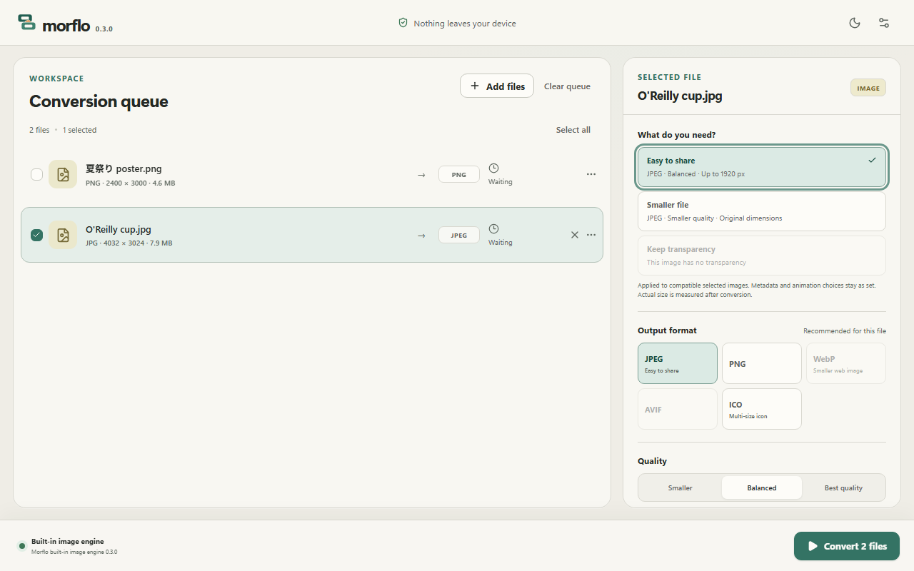

# Morflo

**Convert, resize, and compress images on your Windows desktop. Your files stay local.**

Morflo helps you prepare a photo for sharing, turn WebP into PNG, convert PNG to
JPEG, or process a batch without touching the originals. Common image work uses
an image engine built into the app: no account, upload, or FFmpeg setup required.
Video conversion and animated GIF creation use a compatible locally installed
FFmpeg/ffprobe pair when one is available.

[Getting started](docs/guides/getting-started.md) ·
[Compress images](docs/guides/compress-images-offline.md) ·
[Supported formats](#supported-formats) ·
[Roadmap](docs/product/roadmap.md) ·
[Contribute](CONTRIBUTING.md)

_The app interface with illustrative sample files; the displayed source sizes
are sample data, not compression measurements._

## Choose what you need

- **Easy to share** prepares a balanced JPEG, fitting large images within
  1920 × 1920 px without stretching or enlarging smaller images. Transparent
  areas use the background you choose, with a visible warning.
- **Smaller file** tries a smaller-quality JPEG for opaque images. Transparent
  images use WebP when available, or alpha-preserving PNG with the built-in
  engine. The actual result can be larger; the receipt tells you.
- **Keep transparency** selects PNG at the original dimensions for images
  with transparency.
- **Batch processing** applies an outcome separately to compatible selected
  images. Each file retains its metadata and animation choices.
- **Measured results** show the actual output format, dimensions, bytes and
  size change after conversion. Reveal the result directly in its folder.

Manual format, quality and dimension controls remain available. Animated
sources require an explicit first-frame choice before still-image conversion.

## Availability

The current source checkpoint is **0.3.0**. Windows 11 x64 is the primary target.
A public installer has not been published; use the
[development instructions](docs/development.md) to build from source.
Local Windows installers are unsigned. A source checkpoint does not claim a
signed, publicly distributed release.

Linux has earlier local WSL2/WSLg package evidence. macOS has no completed
runtime validation. See the [platform and release checklist](docs/quality/release-checklist.md).

## Supported formats

Availability comes from the active Rust capability registry. A filename
extension alone never makes an output available.

| Work                        | Built into Morflo                     | With a compatible local media engine                   |
| --------------------------- | ------------------------------------- | ------------------------------------------------------ |
| Read common images          | PNG, JPEG, WebP, GIF, BMP, TIFF, ICO  | Additional formats depend on the engine                |
| Write images                | PNG, JPEG, multi-resolution ICO       | WebP and AVIF when validated encoders are available    |
| Resize and batch images     | Yes                                   | Yes                                                    |
| Preserve transparency       | PNG and ICO                           | PNG, WebP, AVIF and ICO as supported                   |
| Keep source metadata        | Unavailable; choose Remove explicitly | Best-effort mapping, not byte-identical preservation   |
| Convert video               | Unavailable                           | MP4 and WebM when required codecs are available        |
| Create a short animated GIF | Unavailable                           | Local moment strip, range preview and palette pipeline |
| HEIC/HEIF                   | Not verified                          | Not advertised as supported                            |

WebP **input** works with the built-in engine even though WebP **output** needs
a media engine. [Conversion evidence](docs/media/conversion-matrix.md) separates
built-in tests from development-engine tests. No media-engine binary is included
in the source repository or ordinary package.

## Privacy and safe outputs

- Media, names, paths, metadata and thumbnails stay on your device.
- There are no accounts, ads, analytics, crash uploads or conversion-time
  network calls. Runtime assets are local.
- Original files stay unchanged. Existing outputs receive a numeric suffix
  by default; replacement is never silent.
- Output is written to an owned temporary file and published only after a
  successful conversion and output inspection.
- Queue history and previews are session-only. Only the selected preview is
  kept in memory.
- On Windows, Morflo can be an **Open with** candidate for its conservative
  handler set. It does not take over your default apps.

## Learn and help

- [Convert PNG to JPEG and WebP to PNG](docs/guides/convert-images.md)
- [Compress and resize images offline](docs/guides/compress-images-offline.md)
- [Report a bug](https://github.com/snowyukitty/morflo/issues/new?template=bug_report.yml)
- [Suggest an improvement](https://github.com/snowyukitty/morflo/issues/new?template=feature_request.yml)
- [Security reporting](SECURITY.md)
- [Build, test and package](docs/development.md)
- [Changelog](CHANGELOG.md) and [roadmap](docs/product/roadmap.md)

## License

Morflo's source, including its built-in image engine, is dual licensed under
[MIT](LICENSE-MIT) OR [Apache-2.0](LICENSE-APACHE), at your option.
See [LICENSING.md](LICENSING.md) and [third-party notices](THIRD_PARTY_NOTICES.md).
An external FFmpeg build has its own terms. Redistributing an engine requires
separate review of the exact build; see
[media-engine distribution](docs/legal/media-engine-distribution.md).
