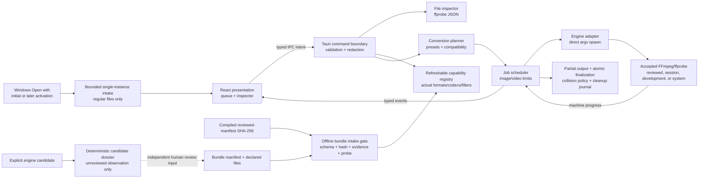

# Architecture overview

Morflo is a Tauri 2 desktop application. React renders intent and state; Rust is the only trusted boundary that can inspect paths or execute media engines.

## Boundaries

1. **Inspection** normalizes ffprobe output into `MediaFile` and warnings without trusting the extension.
2. **Capability discovery** probes a matching `ffmpeg`/`ffprobe` pair, complete decoder/encoder/demuxer/muxer/filter inventories, and then derives implemented output presets. Input support is established by successful structured inspection, not extension tables. Discovery can be refreshed and a user-selected folder lasts only for the current session.
3. **Candidate dossier capture** is an operator-only pre-review boundary. It
   requires explicit execution consent, fixed root tool names, an external
   exclusive output, a complete bounded file inventory before and after
   probing, and records compiler/library/capability observations in canonical
   path-neutral JSON. Its assurance is permanently `unreviewed`; it cannot be
   supplied to runtime or packaging as a manifest.
4. **Reviewed bundle intake** treats the manifest as evidence, not as its own
   trust anchor. A reviewed bundle additionally requires the exact manifest
   SHA-256 compiled into that build. Runtime verification rejects mismatched or
   expired review evidence, unknown/untracked files, traversal, symlinks,
   Windows reparse points, hash/size changes, target drift, tool-version or
   configure-line drift, and any full capability-inventory difference. A
   present invalid bundle is terminal for automatic discovery; it cannot be
   relabelled as reviewed through fallback.
5. **Planning** accepts a `ConversionSpec`, validates constraints, chooses output safely, and returns a structured argument plan. The frontend never supplies arbitrary arguments.
6. **Scheduling** owns queued/probing/ready/running/succeeded/failed/canceled transitions and resource permits.
7. **Execution** launches only discovered `ffmpeg`/`ffprobe` and explicit platform reveal/termination tools with argument arrays—never through a shell. Media-engine children receive a sanitized environment without inherited search paths, homes, credentials, proxies, or dynamic-loader overrides.
8. **Progress** consumes FFmpeg `-progress pipe:1`; unknown phases are indeterminate rather than fabricated.
9. **Output safety** reserves a collision-safe target, writes a recognizable partial with a valid media extension, probes the result, then renames within the same destination directory. The successful event carries a typed `OutputSummary` derived from that probe—never an output path or frontend estimate.
10. **Temporary management** journals only active partial paths. Clean completion removes entries; crash recovery deletes only validated Morflo-owned partial names.
11. **Settings** are schema-versioned and contain preferences, never queue history or file paths by default.
12. **Presentation** receives only typed, minimum-necessary metadata and bounded local preview data. Engine source is one of Reviewed bundled engine, Development engine, Session engine, System engine, or Unavailable; manifest/build/legal detail stays inside collapsed Technical details. Output preview commands resolve paths only through the job manager, re-probe the result, reject non-regular/symlink targets, and cap decode time, dimensions, and returned bytes. Source preview commands resolve a session-owned job identifier in Rust; the GIF moment strip returns exactly seven 160×90 JPEG frames, caps each frame at 256 KiB, permits at most two lightweight samplers, and applies one 20-second overall deadline. A failed strip never disables conversion.

Files supplied on initial or later activation are placed in bounded session
state, limited to 512 existing regular non-symlink files, and sent through the
same inspection boundary as picker/drop input. Relative later-activation paths
are resolved against that activation's working directory. Directories are never
scanned. A later desktop instance only hands off files, restores/focuses the
main window, emits a typed count-only event, and exits; paths remain inside the
trusted Rust/IPC boundary.

## State model

`queued → probing → ready → running → succeeded`

Any active state may move to `failed`; queued or running work may move to `canceled`. Retry creates a new execution attempt from the validated spec instead of mutating terminal history.

GIF work reports `Preparing palette → Encoding → Finalizing`. Image and video work report `Inspecting → Encoding → Finalizing`. Percent is emitted only when duration/frame evidence exists.

## Platform strategy

Platform-specific code is isolated behind process-tree termination, reveal-in-folder, executable discovery, and filesystem finalization adapters. On Windows, discovery supplements the inherited process `PATH` with read-only current machine/user `Path` values so Explorer's stale environment does not create a false missing-engine state. Domain types and plans remain platform-neutral. CI compiles on Windows x64, macOS x64/arm64, and Linux x64; validation claims remain host-specific.

The Windows package path and its narrow App Control recovery boundary are
recorded in [ADR 0002](decisions/0002-native-windows-app-control-build.md).
Windows first-run engine readiness and test-only packaged WebView automation are
recorded in [ADR 0003](decisions/0003-windows-engine-readiness-and-native-testing.md).
The deliberately non-default Windows Open with registration and single-instance
handoff are recorded in
[ADR 0004](decisions/0004-restrained-windows-open-with.md).
The fail-closed reviewed sidecar boundary and opt-in package input are recorded
in [ADR 0005](decisions/0005-reviewed-media-engine-intake.md).
The explicitly unreviewed candidate dossier and sanitized engine-process
environment are recorded in
[ADR 0006](decisions/0006-secure-engine-candidate-dossiers.md).
